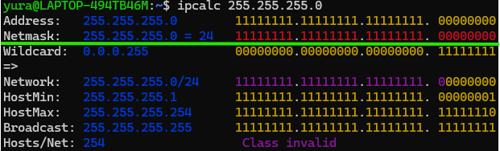
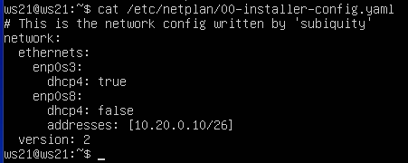
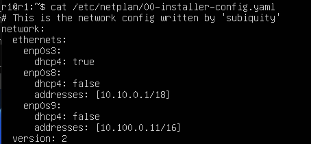
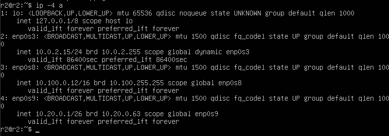
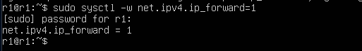
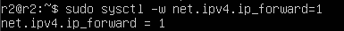
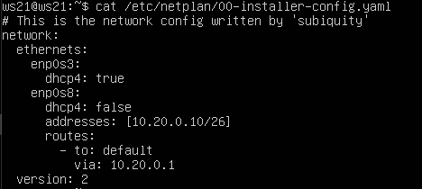
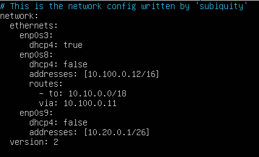
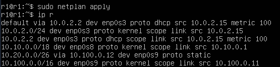

# D02_Linux Network
## Part 1. Инструмент ipcalc
__ipcalc__ - это утилита, с помощью которой можно выполнять простые операции с адресами IPv4. Если набрать ipcalc без каких-либо входных параметров, то на экране появится красивая «справка» с примерами, которые очень полезны для начала работы.
* ___1.1. Сети и маски___
    1) Адрес сети 192.167.38.54/13  
    
    2) Перевод маски 255.255.255.0 в префиксную и двоичную запись, /15 в обычную и двоичную, 11111111.11111111.11111111.11110000 в обычную и префиксную  
        * Перевод в двоичную запись или в префиксную можно посмотреть по специальным таблицам или с помощью `ipcalc`:
        
        
        * Аналогично можно смотреть `/15`:  
        
        * И чтобы определить 11111111.11111111.11111111.11110000, нужно перевести из двоичной системы в десятичную, и далее просмотреть:  
        
    3)  Минимальный и максимальный хост в сети 12.167.38.4 при масках: /8, 11111111.11111111.00000000.00000000, 255.255.254.0 и /4  
    В данном задании используется команда `ipcalc [address]`, в случае двоичной записи требуется перевод в десятичную запись 
        * 12.167.38.4/8:
            * HostMin:   12.0.0.1 
            * HostMax:   12.255.255.254 
        * 12.167.38.4/11111111.11111111.00000000.00000000 (= /16):
            * HostMin:   12.167.0.1
            * HostMax:   12.167.255.254 
        * 12.167.38.4/255.255.254.0:
            * HostMin:   12.167.38.1 
            * HostMax:   12.167.39.254 
        * 12.167.38.4/4:
            * HostMin:   0.0.0.1 
            * HostMax:   15.255.255.254 
* ___1.2. localhost___
    * Определи и запиши в отчёт, можно ли обратиться к приложению, работающему на localhost, со следующими IP: 194.34.23.100, 127.0.0.2, 127.1.0.1, 128.0.0.1  
    Обратиться можно: 127.0.0.2 и 127.1.0.1, пример:  
    
* ___1.3. Диапазоны и сегменты сетей___
    * Определи и запиши в отчёт:
    1) Какие из перечисленных IP можно использовать в качестве публичного, а какие только в качестве частных: 10.0.0.45, 134.43.0.2, 192.168.4.2, 172.20.250.4, 172.0.2.1, 192.172.0.1, 172.68.0.2, 172.16.255.255, 10.10.10.10, 192.169.168.1  
    Для проверки используется тот же ipcalc, в строке Hosts/Net будет отображаться, открыта сеть, или она частная, пример:  
      
    Итого:
        * Публичные: 134.43.0.2, 172.0.2.1, 192.172.0.1, 172.68.0.2, 192.169.168.1 
        * Частные: 10.0.0.45, 192.168.4.2, 172.20.250.4, 172.16.255.255, 10.10.10.10 
    2) Какие из перечисленных IP адресов шлюза возможны у сети 10.10.0.0/18: 10.0.0.1, 10.10.0.2, 10.10.10.10, 10.10.100.1, 10.10.1.255  
     
    Здесь следует рассматривать диапазон [HostMin, HostMax].     * Не подходят: 10.10.100.1, 10.0.0.1, остальные подходят.

## Part 2. Статическая маршрутизация между двумя машинами
* Две вирутальные машины:  

* С помощью команды ip a посмотри существующие сетевые интерфейсы.  
    * ws1:  
    
    * ws2:  
    
* Опиши сетевой интерфейс, соответствующий внутренней сети, на обеих машинах и задать следующие адреса и маски: ws1 - 192.168.100.10, маска /16, ws2 - 172.24.116.8, маска /12.  
    * ws1: lo - 127.0.0.1/8 и enp0s3 - 10.0.2.15/24  
    * ws2: lo - 127.0.0.1/8 и enp0s3 - 10.0.2.15/24  
    * Содержание `etc/netplan/00-installer-config.yaml` после изменения адресов и масок:  
      
      
* Выполни команду netplan apply для перезапуска сервиса сети.  
    * ws1:  
    
    * ws2  
    
* ___2.1. Добавление статического маршрута вручную___  
Используются команды:
    * ws1: `sudo ip r add 172.24.116.8 dev enp0s3` и `ping 172.24.116.8 -c 10`
    * ws2: `sudo ip r add 192.168.100.10 dev enp0s3` и `ping 192.168.100.10 -c 10`
    * c [num] - число пакетов
    * ws1:  
    
    * ws2:  
    
* ___2.2. Добавление статического маршрута с сохранением___  
    * Перезапуск машин: `reboot`
    * После перезапуска видим, что данные не сохранились:  
    
    * Добавь статический маршрут от одной машины до другой с помощью файла /etc/netplan/00-installer-config.yaml.  
        * ws1:  
        
        * ws2:  
        
    * Пропингуй соединение между машинами.  
        * ws1:  
        
        * ws2:  
        

## Part 3. Утилита iperf3
* ___3.1. Скорость соединения___  
    * Переведи и запиши в отчёт: 8 Mbps в MB/s, 100 MB/s в Kbps, 1 Gbps в Mbps.  
    * 8 Mbps = 1 MB/s, 100 MB/s = 800000 Kbps, 1Gbps = 1000 Mbps
*  ___3.2. Утилита iperf3___
    * Измерь скорость соединения между ws1 и ws2.
    1. В качестве сервера будет ws2: `iperf3 -s -f K`  
    
    2. В качестве клиента будет ws1:  
    

## Part 4. Сетевой экран
* ___4.1. Утилита iptables___
    1. Создал файл /etc/firewall.sh, имитирующий фаерволл, на ws1 и ws2.
        * ws1:  
        
        * ws2:  
        
    2. Запустил файлы на обеих машинах командами `chmod +x /etc/firewall.sh` и `/etc/firewall.sh`.  
        * ws1:  
        
        * ws2:  
        
    3. Так как команды выполняются по порядку сврерху вниз, то в случае для первой машины ws1 пинг будет запрещен(потому что accept после drop), а для ws2 пинги разрешены. Применные праивла не могут быть переписаны. 
      
      

* ___4.2. Утилита nmap___
    * Командой ping найди машину, которая не «пингуется», после чего утилитой nmap покажи, что хост машины запущен.  
    * Не пингуется вторая машина. Особенностью nmap является то, что эта утилита может определить, включен ли хост, даже если его нельзя пропинговать. 
    * Проверяемm включен ли хост второй машины через первую:  
    * Хост второй машины, которая не пингуется, включен:  
    

## Part 5. Статическая маршрутизация сети
__Сеть__:  

* Поднятие машин:  

> Чтобы работать одновременно во внутренней сети и при этом скачивать утилиты из Интернета, нужно включить в настройках второй адаптер:  

* ___5.1. Настройка адресов машин___
    * __ws11__:
        * Выставляем в параметре адаптер1: внутрення сеть, имя intnet1:
        
        * Изменение конфигурационного файла:  
        

    * __ws21__:
        * Выставляем в параметре адаптер1: внутрення сеть, имя intnet3:
        
        * Изменение конфигурационного файла:  
        

    * __ws22__:
        * Выставляем в параметре адаптер1: внутрення сеть, имя intnet3:
        
        * Изменение конфигурационного файла:  
        

    * __r1__:
        * Выставляем в параметрах адаптер2 и адаптер3: внутренняя сеть, имена intnet1 и intnet2:  
        
        * Изменение конфигурационного файла:  
        

    * __r2__:
        * Выставляем в параметрах адаптер2 и адаптер3: внутренняя сеть, имена intnet2 и intnet3:  
        
        * Изменение конфигурационного файла:  
        

    * Перезапускаем сервис сети с помощью команды: `sudo netplan apply`  
    * Проверяем адрес машин с помощью: `ip -4 a`  
        * ws11:  
        
        * ws21:  
        
        * ws22:  
        
        * r1:  
        
        * r2:  
        
    
    * Пингуем ws22 с ws21:  
    
    * Пингуем r1 с ws11:  
    

* ___5.2. Включение переадресации IP-адресов___
    * Для включения переадресации IP, выполни команду на роутерах: `sysctl -w net.ipv4.ip_forward=1`. При таком подходе переадресация не будет работать после перезагрузки системы.
        * r1:  
        
        * r2:  
        
    * Открой файл /etc/sysctl.conf и добавь в него следующую строку: `net.ipv4.ip_forward = 1`. При использовании этого подхода, IP-переадресация включена на постоянной основе.
        * r1 и r2:  
        

* ___5.3. Установка маршрута по-умолчанию___
    * Настрой маршрут по-умолчанию (шлюз) для рабочих станций. Для этого добавь default перед IP роутера в файле конфигураций.  
        * ws11:  
        
        * ws21:  
        
        * ws22:  
        
    
    * Вызови ip r и покажи, что добавился маршрут в таблицу маршрутизации.  
        * ws11:  
        
        * ws21:  
        
        * ws22:  
        

    * Пропингуй с ws11 роутер r2 и покажи на r2, что пинг доходит. Для этого используй команду: `tcpdump -tn -i eth0` 
        * ws11:  
        
        * r2:  
        

* ___5.4. Добавление статических маршрутов___
    1. Добавь в роутеры r1 и r2 статические маршруты в файле конфигураций.  
        * r1:  
        
        * r2:  
        
    2. Вызови ip r и покажи таблицы с маршрутами на обоих роутерах.  
        * r1:  
        
        * r2:  
        
    3. Запусти команды на ws11: `ip r list 10.10.0.0/[маска сети]` и `ip r list 0.0.0.0/0`  
    
        * ws11 соединена с сетью 10.10.0.0/18 по своему IP-адресу 10.10.0.2, для других адресов используется маршрут по умолчанию.  Был выбран такой маршрут потому что он обладает большей точностью.

* ___5.5. Построение списка маршрутизаторов___
    
    * При помощи утилиты traceroute построй список маршрутизаторов на пути от ws11 до ws21.  
    
    * При этом на r1 отображаются дополнительные данные.  
    * Traceroute — это утилита, которая позволяет проследить маршрут следования данных до удаленного адресата в сетях TCP/IP. В Linux используется команда Traceroute. Утилита Traceroute формирует UDP-датаграмму (сообщение, которое нужно доставить целевому серверу), упаковывает ее в IP-пакет и передаёт первому транзитному узлу. В заголовке такого IP-пакета есть поле TTL (Time To Live) — время жизни пакета. Оно определяет количество хопов, через которые пакет может пройти. На каждом узле TTL уменьшается на единицу. Если на пути к удаленному адресату время жизни пакета станет равно 0, маршрутизатор отбросит пакет и отправит источнику ICMP-сообщение об ошибке «Time Exceeded» (время истекло).

* ___5.6. Использование протокола ICMP при маршрутизации___
    1. Запусти на r1 перехват сетевого трафика, проходящего через eth0 с помощью команды: `tcpdump -n -i eth0 icmp` 
    
    2. Пропингуй с ws11 несуществующий IP (например, 10.30.0.111) с помощью команды: `ping -c 1 10.30.0.111`  
    

## Part 6. Динамическая настройка IP с помощью DHCP

* __6.1. Укажи адрес маршрутизатора по-умолчанию, DNS-сервер и адрес внутренней сети. Пример файла для r2:__
    * Устанавливаем isc-dhcp-server, далее меняем конфигурационный файл:  
    

* __6.2. В файле resolv.conf пропиши nameserver 8.8.8.8.__  
    

* __6.3. Перезагрузи службу DHCP командой systemctl restart isc-dhcp-server. Машину ws21 перезагрузи при помощи reboot и через ip a покажи, что она получила адрес. Также пропингуй ws22 с ws21.__  
    1. Рестарт службы   
    
    2. Меняем конфигурационные файлы, чтобы разрешить службу dhcp4:  
    
    
    3. Резуельтат `ip a`:  
        * ws21:  
        
        * ws22:  
        
    4. Пинг ws22 с ws21:  
        

* __6.4. Укажи MAC адрес у ws11, для этого в etc/netplan/00-installer-config.yaml надо добавить строки: macaddress: 10:10:10:10:10:BA, dhcp4: true.__
    1. Изменение конфигурационного файла:  
    
    
* Аналогично для r1:  
    1. Установить `isc-dhcp-server` 
    2. Изменить `/etc/dhcp/dhcpd.conf`  
    
    3. Изменить `/etc/resolv.conf`:  
    
    
    4. Резуельтат `ip a` для ws11:  
    
    5. Пинг:  
    
    
* __6.5. Запроси с ws21 обновление ip адреса.__
    1. IP до обновления:  
    
    2. Обновление с помощью: `sudo dhclient`:  
    
    3. Удаление старого ip: `sudo dhclient -r` 
    
    4. Для удаления или обновления кокретного сетевого интерфейса добавляют в конце имя интерфейса. `sudo dhclient -r eth0`
    
    * Были использованы следующие опции DHCP протокола:
    option routers ip-address [, ip-address...]; - адреса шлюзов для клиентской сети.  
    option domain-name-servers ip-address [, ip-address...]; - Список DNS серверов доступных клиенту. Сервера должны быть перечислены в порядке предпочтительности.

## Part 7. NAT

* Устанавливаем apache2: `sudo apt install apache2`
* __7.1. В файле /etc/apache2/ports.conf на ws22 и r1 измени строку Listen 80 на Listen 0.0.0.0:80, то есть сделай сервер Apache2 общедоступным.__  
    * r1:  
    
    * ws22:  

* __7.2. Запусти веб-сервер Apache командой service apache2 start на ws22 и r1.__
    * r1:  
    
    * ws22:  

* __7.3. Добавь в фаервол, созданный по аналогии с фаерволом из Части 4, на r2 следующие правила:__
    1) Удаление правил в таблице filter - iptables -F;  
    2) Удаление правил в таблице "NAT" - iptables -F -t nat;  
    3) Отбрасывать все маршрутизируемые пакеты - iptables --policy FORWARD DROP.  
    
    4) Запусти файл также, как в Части 4.  
      
    Пинг:  
    
    
* __7.4. Добавь в файл ещё одно правило:__
    4) Разрешить маршрутизацию всех пакетов протокола ICMP.  
    

* __7.5. Включи SNAT, а именно маскирование всех локальных ip из локальной сети, находящейся за r2 (по обозначениям из Части 5 - сеть 10.20.0.0).Включи DNAT на 8080 порт машины r2 и добавить к веб-серверу Apache, запущенному на ws22, доступ извне сети. __
    

